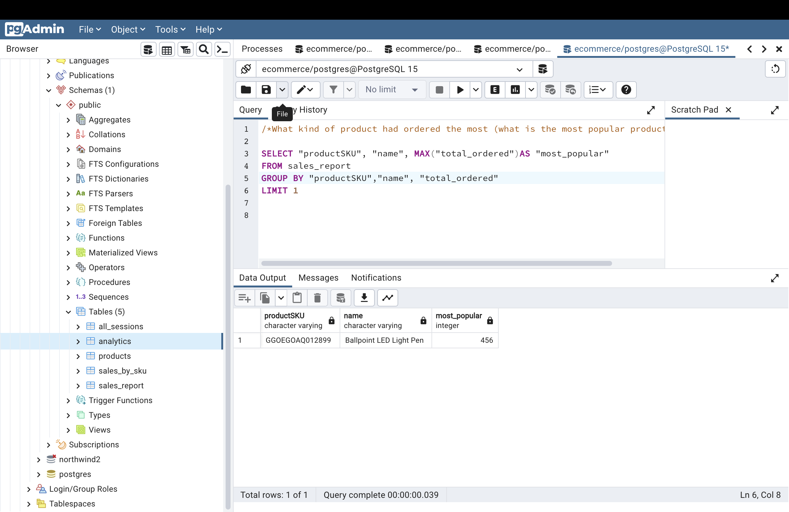
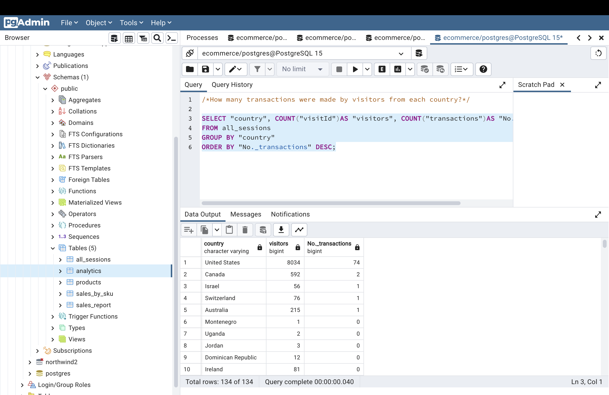
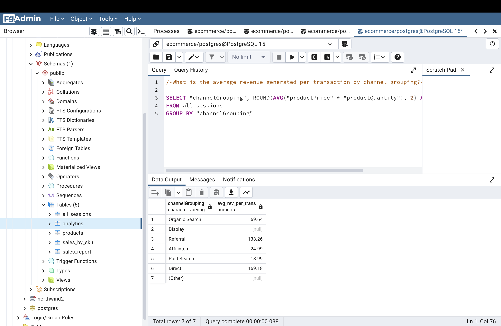

Question 1: 
 - What kind of product had ordered the most (what is the most popular product name? )

SQL Queries:

SELECT "productSKU", "name", MAX("total_ordered")AS "most_popular"

FROM sales_report

GROUP BY "productSKU","name", "total_ordered"

LIMIT 1

Answer: 

PRODUCT SKU :   "GGOEGOAQ012899"    
 NAME       :    "Ballpoint LED Light Pen"       
 MOST POPULAR:  456

Question 2: 
- How many transactions were made by visitors from each country? 

SQL Queries:

SELECT "country", COUNT("visitId")AS "visitors", COUNT("transactions")AS "No._transactions"

FROM all_sessions

GROUP BY "country"

ORDER BY "No._transactions" DESC;

Answer:

Question 3: 
- What is the average revenue generated per transaction by channel grouping?(organic search, referral, paid search etc.) 

SQL Queries:

SELECT "channelGrouping", ROUND(AVG("productPrice" * "productQuantity"), 2) AS "avg_rev_per_trans"

FROM all_sessions

GROUP BY "channelGrouping";

Answer:

