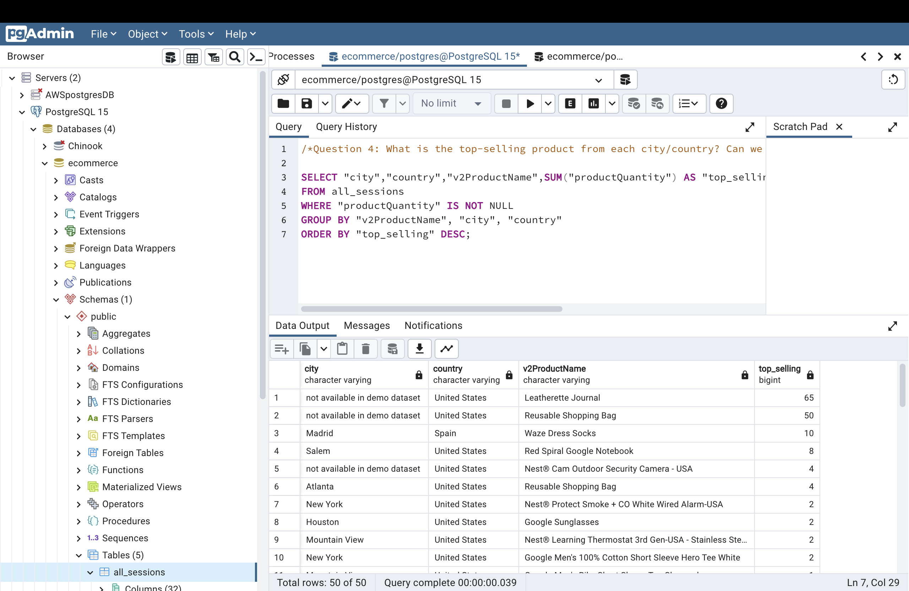

Answer the following questions and provide the SQL queries used to find the answer.

    
**Question 1: Which cities and countries have the highest level of transaction revenues on the site?**

SQL Queries:

SELECT "city", "country", SUM("totalTransactionRevenue") as "total_Revenue"

FROM all_sessions

WHERE "totalTransactionRevenue" IS NOT null

GROUP BY "city", "country"

ORDER BY "total_Revenue" DESC;

Answer:
CITY   
COUNTRY  
TOTAL REVENUE

not availableindemo dataset	,
United States,	    
6092.56

San Francisco,	
United States,
1564.32

Sunnyvale,
United States,    	
992.23

**Question 2: What is the average number of products ordered from visitors in each city and country?**

SQL Queries:

SELECT "city","country", ROUND(AVG("num_products"),2) AS "avg_ordered"

FROM (
	SELECT "city","country", "visitId", COUNT ("productSKU") AS "num_products"
    FROM all_sessions
    GROUP BY "city","country", "visitId") AS sub

GROUP BY "city","country";

Answer:

**Question 3: Is there any pattern in the types (product categories) of products ordered from visitors in each city and country?**

SQL Queries:

SELECT "city", "country", "v2ProductCategory", COUNT(DISTINCT"visitId")AS "No_visit"

FROM (
     SELECT A."city",A."country",A."v2ProductCategory",A."visitId",A."productSKU", S."total_ordered"
     FROM all_sessions A
     INNER JOIN sales_report S on S."productSKU" = A."productSKU") AS sub

GROUP BY "city", "country", "v2ProductCategory"

ORDER BY "city", "country", "No_visit" DESC ;

Answer:

**Question 4: What is the top-selling product from each city/country? Can we find any pattern worthy of noting in the products sold?**

SQL Queries:

SELECT "city","country","v2ProductName",SUM("productQuantity") AS "top_selling"

FROM all_sessions

WHERE "productQuantity" IS NOT NULL

GROUP BY "v2ProductName", "city", "country"

ORDER BY "top_selling" DESC;

Answer:

**Question 5: Can we summarize the impact of revenue generated from each city/country?**

SQL Queries:

SELECT "city", "country", SUM("totalTransactionRevenue")AS "sum_Revenue"

FROM all_sessions

WHERE "totalTransactionRevenue" IS NOT null

GROUP BY "city", "country"

ORDER BY "sum_Revenue" DESC;

Answer:

